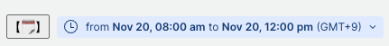
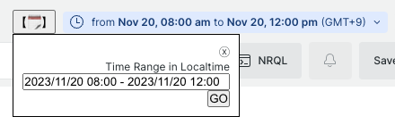

# userscript-nr-date-time-range-picker

Tampermonkey script to add a date and time range input to the New Relic One website.

Easy to use, can **COPY and PASTE** the date and time range to other pages.





# This script does what?

1. Pick `begin` and `end` from URL query parameters.
    - If `begin` and `end` are not found, and if `duration` found, calculate `begin` and `end` from `duration`.
    - When also `duration` is not found, out of scope.
2. Push `GO` or hit `ENTER` key to apply the date and time range to the page.
    1. Set `begin` and `end` query string to the URL.
    2. Remove `duration` query string from the URL.
    3. `window.location.href = newUrl;`

## Restrictions

- Logs(`/logger`) is not supported.
    - Search condition will lost when you change DateTimeRange and Go. SO, copy search condition and paste after moved.

# Install

1. Install Tampermonkey extension for your browser if not yet installed.
2. Tampermonkey extension option > Utility tab > Import from URL

    ```
    https://github.com/netmarkjp/userscript-nr-date-time-range-picker/releases/latest/download/userscript-nr-date-time-range-picker.js
    ```
